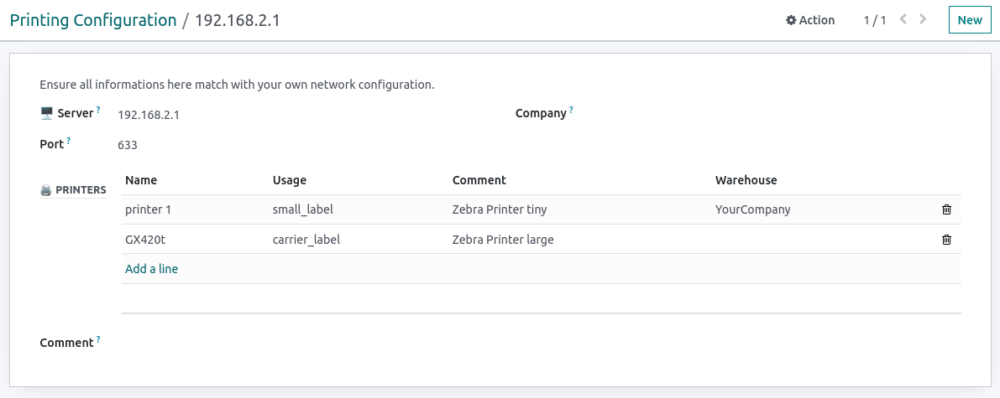

Allow to set printer config definition attached to a company or a warehouse.

With this minimal configuration, you may define specific print workflow
according to misc usage, i.e. label printers

For more complex configuration please check
https://github.com/OCA/report-print-send/blob/16.0/base_report_to_printer/README.rst
